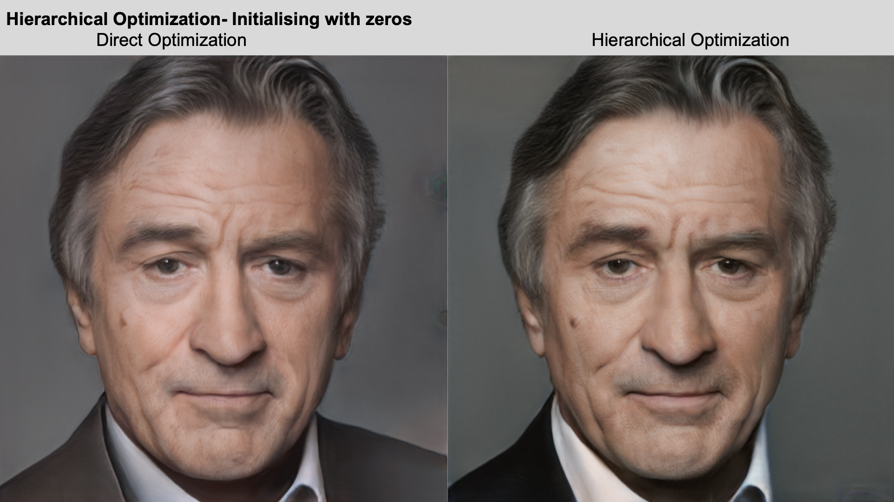
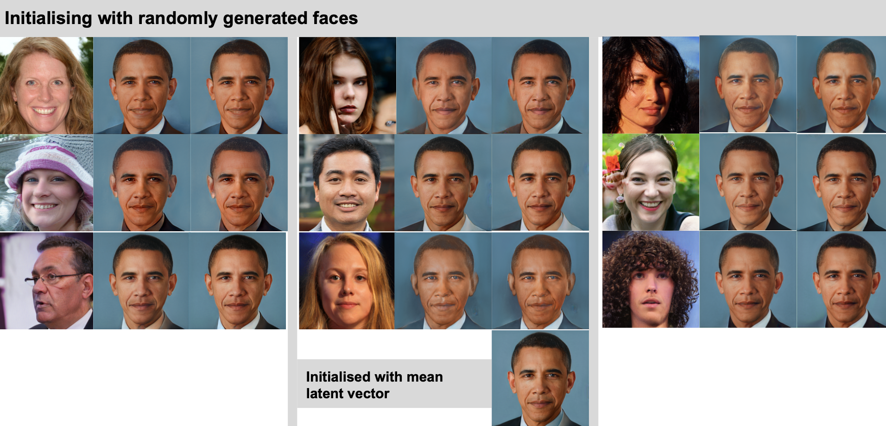
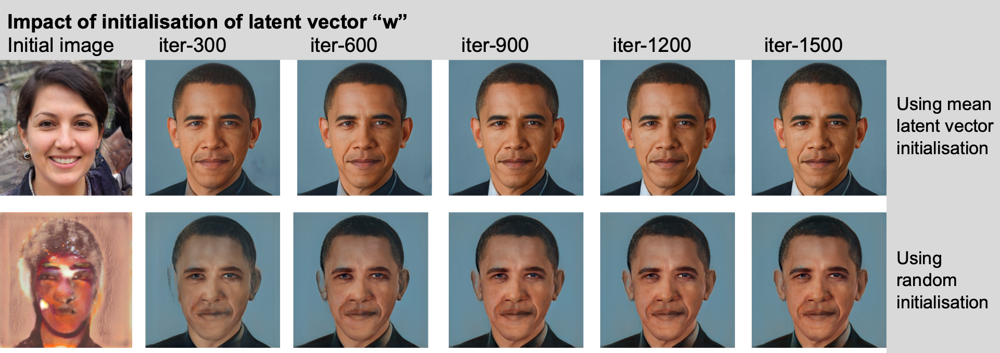
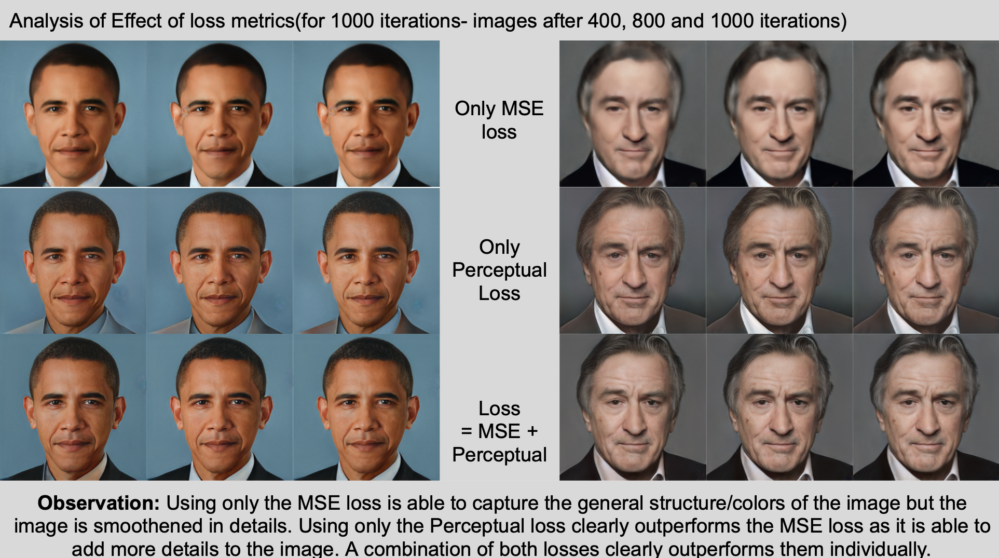
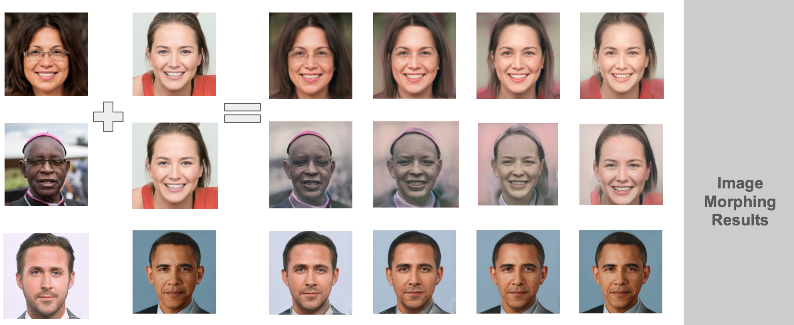

# StyleGAN-PyTorch
This is a setup of Official Implementation of StyleGAN in Pytorch

### References
This implementation was taken from https://github.com/NVlabs/stylegan

## Acknowledgement
This project is a part of my internship at KAUST in the under the supervision of Professor Peter Wonka.

## Pre-trained Model
If you need the pre-trained SG2-ADA model used as a backbone in the experiments, please contact me.

## Experimental Results

Stay tuned for some more results on various experimental results.
